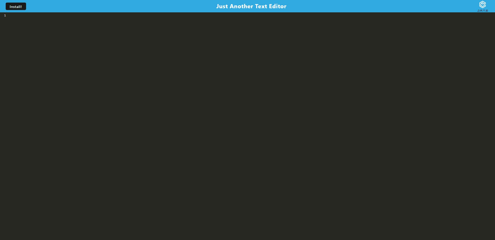

# Text Editor by Terry Kim
Text Editor by Terry Kim

This application is a basic text editor app. Once inside the browser version of this application, you can install it to act as its own application.

This application is generic from a front view, however, the concept is to have any content from users to be stored into a database.

The application can be installed with the install button on the nav bar, which will open its own text editor app.

## Installation

- Clone this repository to retrieve all the files and folders
- Run npm install
- Run npm start
- Go to localhost:3000 to begin using it

    
## Screenshots

Link to the deployment page: https://blooming-everglades-27838.herokuapp.com/

## Authors

- [@Terry Kim](https://www.github.com/TeryKing)

## Acknowledgements

Georgia Tech Coding Bootcamp: https://bootcamp.pe.gatech.edu/coding/

W3Schools: https://www.w3schools.com/

MDN : https://developer.mozilla.org/en-US/

Readme.so: https://readme.so/

NPMJS: https://www.npmjs.com/
## Feedback

If you have any feedback, please reach out to me at Tery_x3@hotmail.com

